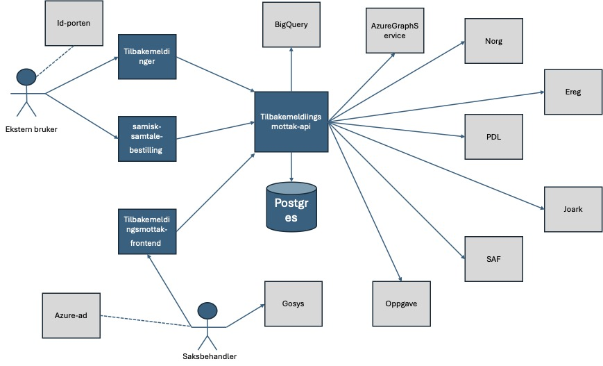

Tilbakemeldingsmottak
================

Tilbakemeldingsmottak / Serviceklage er en backend applikasjon
for [tilbakemeldinger](https://www.nav.no/person/kontakt-oss/nb/tilbakemeldinger/) for mottak fra eksterne brukere av:

* serviceklager og midlertidig lagring i lokal Postgres database. Konvertering av klagen til PDF. Validering av klagen
  ved oppslag mot PDL og Ereg. Arkivering i Joark og oppretting av Oppgave til Gosys, samt videresending av klage til
  Datavarehus via BigQuery
* melding om feil og mangler hos NAV og videresending av melding på epost via AzureGraphService
* Ros til Nav. Disse videresendes på epost via AzureGraphService

I tillegg er den backend for applikasjonen samisk-samtale-bestilling for mottak fra eksterne brukere av:

* bestilling av samtale på samisk. Disse videresendes på epost via AzureGraphService

I tillegg er den en backend for applikasjonen tilbakemeldinger-frontend for saksbehandlere for:

* klassifisering av serviceklager. Gitt oppgaveid hentes serviceklage data fra Joark via SAF. Bruker Norg for register
  data. Klassifisering lagres midlertidig i lokal Postgres database og videresendes Datavarehus via BigQuery

Applikasjonens omgivelser er vist i figuren nedenfor.

Applikasjonen er skrevet i kotlin med Spring Boot og maven for bygging.

Merk at pr 1/11-2025 kjører applikasjonen i dev miljøet med en branch med Spring Boot 4.0.0-M3 der Spring Security er
tatt i bruk.
Denne versjonen er planlagt for produksjon når offisiel Spring Boot 4.0 blir sluppet.

# Komme i gang

Applikasjonen kjører Java 21. Hvordan bygge, teste og kjøre koden:

## Bygging lokalt

* Kjør `mvn clean install`
* Kjør `docker-compose up` for å kjøre opp mocks og database lokalt
* Kjør Spring Boot applikasjonen med `local` som aktiv profil (`-Dspring.profiles.active=local`)

### Autentisering

Denne applikasjonen forventer token fra issuers `azuread` eller `tokenx`.
Tilbakemeldinger applikasjonen vil gjøre kall mot denne applikasjonen med tokenx dersom bruker er logget på via
Id-porten, ellers vil den bruker AzureAd utstedt token.
Tilbakemeldingsmottak-frontend applikasjonen vil gjøre kall mot denne applikasjonen med azuread på vegne av
saksbehandler.

- For tokenx (brukere som er innlogget og sender inn serviceklage):
    - Gå til `http://localhost:6969/tokenx/debugger` og velg "Get a token" med hva som helst i user objektet. Et `pid`
      claim er lagt på i tokenet
- For azuread (vanlig `client_credentials`, ikke-innlogget server-til-server kommunikasjon):
    - Gå til `http://localhost:6969/azuread/debugger` og velg "Get a token" med hva som helst i user objektet
- For azuread (brukere som skal klassifisere serviceklager):
    - Gå til `http://localhost:6969/azuread/debugger` og bytt ut `somescope` med `frontend`. Velg deretter "Get a token"
      med hva som helst i user objektet

### Test i miljøet

En mock auth server kjøres via docker-compose og kan brukes til å generere gyldige tokens lokalt.
For å teste appliaksjonen er en avhengig av å ha:

1. En test-ident for saksbehandler opprettet i [Ida](https://ida.nais.adeo.no/)
    - Brukeren må ha nasjonal tilgang, tilgang til gosys, enhet 4100 (fra 2025, tidligere 4200) og tema SRV Serviceklage
2. Testperson opprettet i [dolly](https://dolly.nais.preprod.local/)

Innsending gjøres innlogget/uinlogget
fra [Kontakt oss/Tilbakemelding](https://www.intern.dev.nav.no/person/kontakt-oss/nb/tilbakemeldinger)

Saksbehandling gjøres via [Gosys](https://gosys-q1.dev.intern.nav.no/gosys/)

## Regenerering av serviceklage PDF

Dersom det har gått feil i generering av PDF av serviceklage som har blitt lagt inn i arkivet, kan denne regenereres ved
å benytte testen i ReGenereringAvPdf. Dette forutsetter at det bygges opp en xslx fil med data basert på serviceklagen i
databasen og bruker informasjon og datoer i fra arkivet.

## Big Query og datavarehus

Det legges inn data for serviceklager i Big Query (`tilbakemeldingsmottak_metrics`) for at datavarehus skal kunne hente
ut statistikk på dette.

## Deploy til dev/prod

Håndteres av [Github workflow](https://github.com/navikt/tilbakemeldingsmottak-api/tree/main/.github/workflows)

## OpenAPI

En OpenAPI definisjon ligger
i [api/src/main/resources/tilbakemeldingsmottak-api.yml](api/src/main/resources/tilbakemeldingsmottak-api.yml)
og brukes til å generere interfaces og domeneobjekter for apiet, samt som dokumentasjon på apiet
(dette gjøres
via [OpenAPI Generator Maven Plugin](https://github.com/OpenAPITools/openapi-generator/tree/master/modules/openapi-generator-maven-plugin)).
Den kan også enkelt importeres i Postman eller andre verktøy for å teste apiet.

For å opprettholde samme format på enums som ble brukt før, er det lagt til egne templates for dette.
Disse er basert
på [templates](https://github.com/OpenAPITools/openapi-generator/tree/master/modules/openapi-generator/src/main/resources/JavaSpring)
fra OpenAPI Generator.

# Henvendelser

Applikasjonen vedlikeholdes av teamserviceklage / Team Fyllut Sendinn.

Spørsmål knyttet til koden eller prosjektet kan stilles som issues her på GitHub.

## For NAV-ansatte

Interne henvendelser kan sendes via Slack i kanalen **#team-fyllut-sendinn**.
